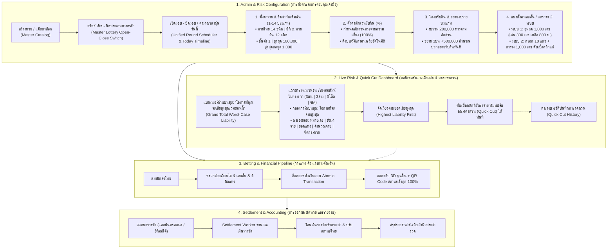
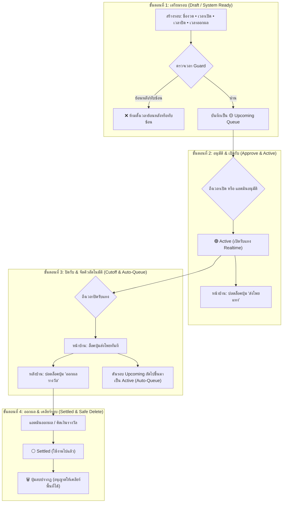
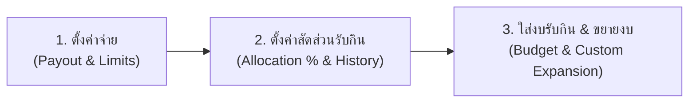
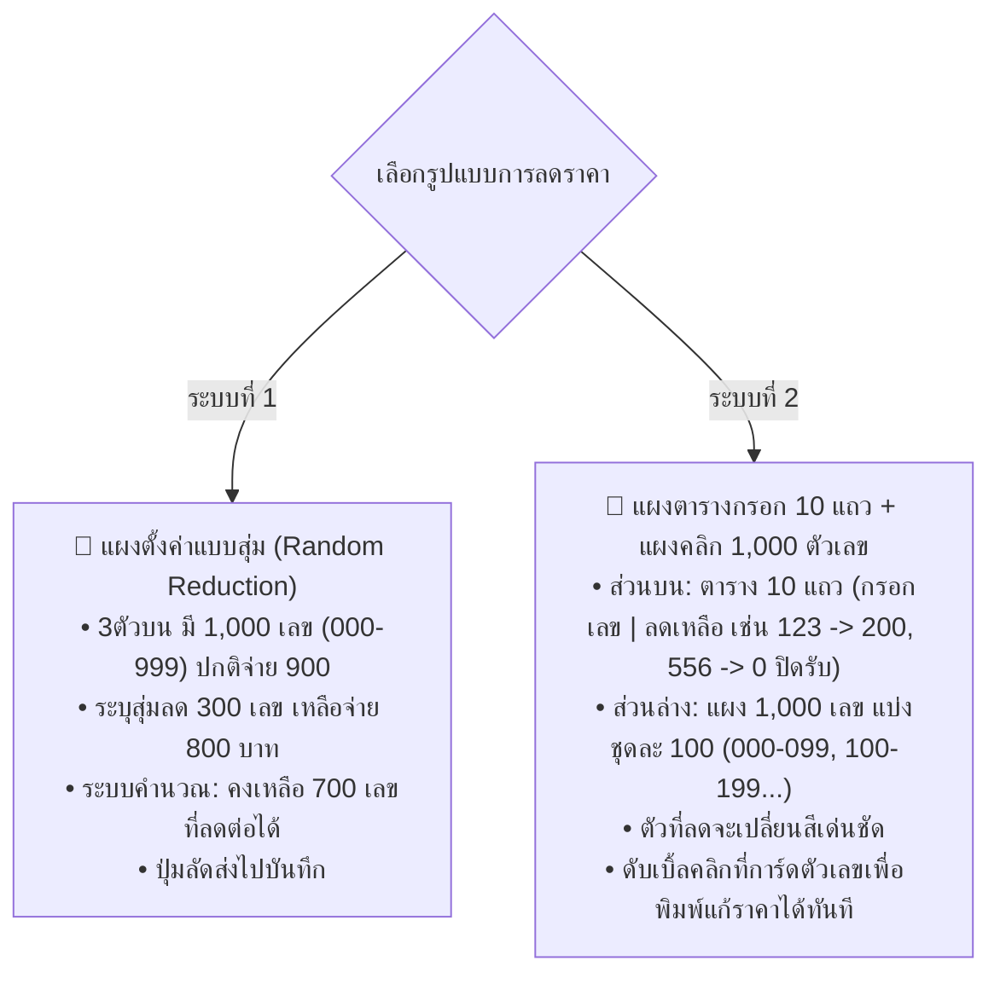
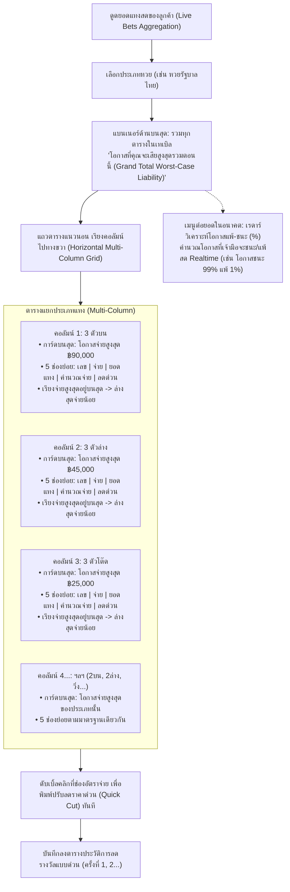
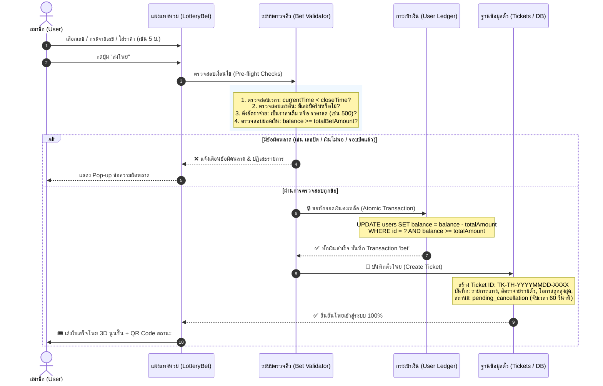
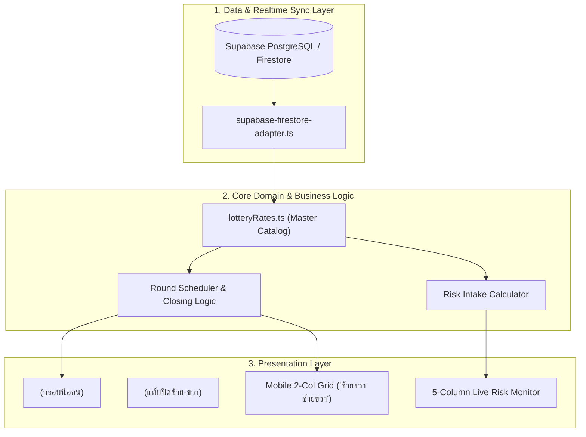

# 📘 AK88 LOTTO — Master System Architecture & Engine Documentation (DOC)

> **เวอร์ชันเอกสาร:** 2.6 (Professional Bookmaker Core Architecture)  
> **อัปเดตล่าสุด:** 09 ตุลาคม 2026  
> **ระบบฐานข้อมูล:** Supabase PostgreSQL / Realtime Event Ledger  
> **สถานะระบบ:** 🟢 **Production Ready (Vercel + Docker Ready)**

---

## สารบัญ (Table of Contents)
1. [ภาพรวมสถาปัตยกรรมระดับองค์กร (Master Blueprint Flowchart)](#1-ภาพรวมสถาปัตยกรรมระดับองค์กร)
2. [ระบบเปิดรอบและจัดตารางรอบรวมศูนย์ (Unified Round Scheduler & Today Timeline)](#2-ระบบเปิดรอบและจัดตารางรอบรวมศูนย์)
3. [กลไกการตั้งค่าความเสี่ยง 3 ขั้นตอน (3-Step Financial & Risk Engine)](#3-กลไกการตั้งค่าความเสี่ยง-3-ขั้นตอน)
   - 3.1 [ขั้นตอนที่ 1: ตั้งค่าจ่ายและขีดจำกัดเดิมพัน 1-14 ประเภท (Payout Rates & Limits)](#31-ขั้นตอนที่-1-ตั้งค่าจ่ายและขีดจำกัดเดิมพัน-1-14-ประเภท)
   - 3.2 [ขั้นตอนที่ 2: ตั้งค่าสัดส่วนรับกินพร้อมระบบดึงประวัติเฉลี่ย (Allocation % & History Auto-Average)](#32-ขั้นตอนที่-2-ตั้งค่าสัดส่วนรับกินพร้อมระบบดึงประวัติเฉลี่ย)
   - 3.3 [ขั้นตอนที่ 3: ใส่งบรับกินและการขยายงบเฉพาะประเภท (Intake Budget & Custom Expansion)](#33-ขั้นตอนที่-3-ใส่งบรับกินและการขยายงบเฉพาะประเภท)
4. [แผงตั้งค่าลดราคาเลขอั้น 2 ระบบ (Dual-Mode Number Reduction Panel)](#4-แผงตั้งค่าลดราคาเลขอั้น-2-ระบบ)
   - 4.1 [ระบบที่ 1: แผงลดราคาแบบสุ่ม (Random 1,000 Numbers Reduction)](#41-ระบบที่-1-แผงลดราคาแบบสุ่ม)
   - 4.2 [ระบบที่ 2: แผงตารางกรอก 10 แถว + แผงคลิก 1,000 ตัวเลข (Manual 10-Row Form & 1,000 Interactive Grid)](#42-ระบบที่-2-แผงตารางกรอก-10-แถว--แผงคลิก-1000-ตัวเลข)
5. [แดชบอร์ดมอนิเตอร์ความเสี่ยงสดและระบบลดเลขด่วน (Multi-Column Live Risk Monitor & Quick Cut)](#5-แดชบอร์ดมอนิเตอร์ความเสี่ยงสดและระบบลดเลขด่วน)
   - 5.1 [โครงสร้างหน้าจอมอนิเตอร์แบบคอลัมน์แนวนอนและ 5 ช่องย่อย (Horizontal Multi-Column Layout & 5 Sub-Columns)](#51-โครงสร้างหน้าจอมอนิเตอร์แบบคอลัมน์แนวนอนและ-5-ช่องย่อย)
   - 5.2 [ระบบดับเบิ้ลคลิกปรับลดราคาด่วนและประวัติการลด (Double-Click Quick Cut & History Log)](#52-ระบบดับเบิ้ลคลิกปรับลดราคาด่วนและประวัติการลด)
   - 5.3 [เรดาร์วิเคราะห์โอกาสแพ้-ชนะ (%) (Realtime Win/Loss Probability Radar)](#53-เรดาร์วิเคราะห์โอกาสแพ้-ชนะ-)
6. [กระบวนการแทง คิว และการตัดเงินแบบ Atomic (Bet Execution & Idempotency Pipeline)](#6-กระบวนการแทง-คิว-และการตัดเงินแบบ-atomic)
7. [เครื่องจักรออกผล ตัดหวย และคิดเงินรางวัล (Result Settlement Engine)](#7-เครื่องจักรออกผล-ตัดหวย-และคิดเงินรางวัล)
8. [โครงสร้างตารางฐานข้อมูล (Data Dictionary & Schema Specifications)](#8-โครงสร้างตารางฐานข้อมูล)
9. [คู่มือการติดตั้งและการรันระบบผ่าน Docker (Container Deployment)](#9-คู่มือการติดตั้งและการรันระบบผ่าน-docker)

---

## 1. ภาพรวมสถาปัตยกรรมระดับองค์กร

ระบบ AK88 LOTTO ออกแบบด้วยมาตรฐานของเจ้ามือมืออาชีพ (Professional Bookmaker Platform) แยกส่วนการทำงานของ **การเปิดหวย $\rightarrow$ สวิตช์เปิด/ปิดหลัก $\rightarrow$ การเปิดรอบ/ปิดรอบ $\rightarrow$ การตั้งค่าการเงิน 3 ขั้นตอน $\rightarrow$ แผงลดเลขอั้น $\rightarrow$ แดชบอร์ดมอนิเตอร์สด** ออกจากกันอย่างเป็นระบบ เพื่อความเข้าใจและควบคุมได้ 100%:



---

## 2. ระบบเปิดรอบและจัดตารางรอบรวมศูนย์ (Unified Round Scheduler & Today Timeline)

ระบบรวมศูนย์การเปิดรอบและจัดตารางไว้ใน **หน้าเดียวกันทั้งหมด** ไม่ต้องสลับหน้าจอ และ **ตัดฟังก์ชันปฏิทินที่ซับซ้อนออก** เปลี่ยนเป็น **"ตารางเวลาลุ้นวันนี้ (Today's Timeline & Action Schedule)"** เพื่อให้เจ้ามือและพนักงานเห็นชัดเจนว่าวันนี้มีรอบไหนเปิดรับ รอบไหนปิดรับ และรอบไหนเวลาออกผล

### 2.1 กระบวนการเปิดรอบแบบ 2 ขั้นตอน (Centralized 2-Step Round Opening)
1. **ขั้นตอนที่ 1: ขั้นร่าง / เตรียมความพร้อมระบบ (Step 1: Draft & System Ready)**
   - แอดมินหรือระบบ Engine สร้างรอบล่วงหน้า ระบุชื่องวด, เวลาเปิดรับ, เวลาปิดรับ, และเวลาออกผล
   - ระบบตรวจสอบความถูกต้อง (เวลาย้อนหลัง? เวลาทับซ้อน?)
   - รอบจะถูกบันทึกในสถานะรออนุมัติ หรือเตรียมพร้อมในคิว (Upcoming Queue)
2. **ขั้นตอนที่ 2: อนุมัติ / เปิดรับแทงจริง (Step 2: Approve & Active Execution)**
   - แอดมินกดเปิดใช้งานจริง หรือระบบอัตโนมัติตาม Trigger เวลาเปิด
   - สถานะเปลี่ยนเป็น 🟢 **Active** หน้าบ้านรับรู้ Realtime และเปิดให้สมาชิกแทงทันที

### 2.2 โครงสร้าง 4 สถานะมาตรฐาน (4 Operational States)
| สถานะ | ไอคอน & สี | พฤติกรรมหน้าบ้าน (Frontend) | พฤติกรรมหลังบ้าน (Backend) |
|---|---|---|---|
| **Active** | 🟢 เขียว | เปิดรับแทงปกติ, นาฬิกานับถอยหลังสู่เวลาปิดรับ | มอนิเตอร์ยอดแทงสด, ปรับลดราคาเลขอั้นด่วน |
| **Upcoming** | 🟡 เหลือง | แสดงรอบที่จะเปิดถัดไป, ปุ่มส่งโพยถูกปิด (Disabled) | จัดเตรียมคิวรอบ, แก้ไขเวลาหรือตั้งค่าล่วงหน้าได้ |
| **Settled / Closed** | ⚪ ขาว/เทา | ปิดรับแทง, แสดงผลรางวัลที่ออกแล้ว และใบตรวจผล | ปุ่มออกรางวัลทำงาน / สรุปยอดได้เสีย / ปุ่มลบปรากฏ |
| **Inactive / No Rounds** | 🩶 เทาเข้ม | ปิดรับแทงทุกช่องทาง, แจ้งเตือน "ไม่มีรอบเปิดรับแทง" | แอดมินเปิดสวิตช์ปิดระบบ หรือยังไม่มีการสร้างรอบ |

### 2.3 ระบบจัดคิวรอบต่อเนื่องอัตโนมัติ (Continuous Auto-Queueing)
- เมื่อรอบปัจจุบันหมดเวลาปิดรับแทง (Cutoff Time) ระบบจะตัดรอบเข้าสู่กระบวนการเตรียมออกผลทันที
- รอบถัดไปที่อยู่ในคิวสถานะ 🟡 **Upcoming** จะถูกดันขึ้นมาเป็นรอบหลัก และเปลี่ยนเป็น 🟢 **Active** อัตโนมัติเมื่อถึงเวลาเปิดรับ โดยไม่ต้องให้แอดมินมารีเฟรชหรือกดเปิดเองทุกรอบ

### 2.4 กฎการควบคุมปุ่มและการเข้าถึง (UI Button State Gating)
- **หน้าบ้าน (Frontend Gate):**
  - ปุ่ม **"ส่งโพยแทง"** จะกดได้เฉพาะเมื่อรอบอยู่ในสถานะ 🟢 **Active** เท่านั้น
  - หากอยู่ในสถานะ 🟡 **Upcoming**, ⚪ **Settled**, หรือ 🩶 **Inactive** ปุ่มจะถูก Disable พร้อมข้อความแจ้งสถานะ เช่น *"รอบนี้ปิดรับแทงแล้ว"* หรือ *"รอบยังไม่เปิดรับแทง"*
- **หลังบ้าน (Backend Gate):**
  - ปุ่ม **"ออกรางวัล"** จะถูกซ่อนหรือ Disable ไว้ตลอดเวลาจนกว่ารอบจะถึงเวลาปิดรับแทง (Closed) ป้องกันอุบัติเหตุแอดมินเผลอกดออกผลขณะสมาชิกร่วมแทงอยู่
  - ปุ่ม **"ลบ"** จะปรากฏเฉพาะรอบที่อยู่ในสถานะ ⚪ **Settled / ใช้งานไปแล้ว** เท่านั้น ห้ามลบรอบที่กำลัง Active หรือ Upcoming เด็ดขาด



---

## 3. กลไกการตั้งค่าความเสี่ยง 3 ขั้นตอน

แยกฟังก์ชันการตั้งค่าความเสี่ยงออกเป็น 3 ขั้นตอนอย่างเป็นเอกเทศ เพื่อความเข้าใจและคำนวณได้อย่างถูกต้องแม่นยำ:



### 3.1 ขั้นตอนที่ 1: ตั้งค่าจ่ายและขีดจำกัดเดิมพัน 1-14 ประเภท (Payout Rates & Limits)
- **1.1 ขีดจำกัดเดิมพันมาตรฐาน (Bet Limits):**
  - **แทงขั้นต่ำ:** 1 บาท
  - **แทงสูงสุดต่อครั้ง/บิล:** 100,000 บาท
  - **แทงสูงสุดต่อยูสเซอร์ (User Exposure Cap):** 1,000 บาท (ต่อเลขหรือต่อคน เพื่อจำกัดความเสี่ยงไม่ให้ผู้เล่นคนเดียวแทงท่วม)
- **1.2 ตารางอัตราจ่ายมาตรฐานกลางและส่วนลด (Master Payout Rates & Discounts Table 1-14):**
  | No. | หมวด | รายการ (Bet Type) | อัตราจ่าย (บาท) | ส่วนลด (%) | สิทธิ์การเปิดรับแทงตามประเภทหวย |
  |:---:|:---:|:---|:---:|:---:|:---|
  | **1** | 3 ตัว | 3 ตัวบน | 900.00 | 0% | ทุกหวย (หวยไทย, ยี่กี, ฮานอย, ลาว, มาเลย์, หุ้น) |
  | **2** | 3 ตัว | 3 ตัวโต๊ด | 150.00 | 0% | ทุกหวย (หวยไทย, ยี่กี, ฮานอย, ลาว, มาเลย์, หุ้น) |
  | **3** | 3 ตัว | 3 ตัวล่าง | 450.00 | 0% | 🇹🇭 **เฉพาะหวยไทยเท่านั้น** (ยี่กีและหวยอื่นตัดออกอัตโนมัติ) |
  | **4** | 2 ตัว | 2 ตัวบน | 90.00 | 0% | ทุกหวย (หวยไทย, ยี่กี, ฮานอย, ลาว, มาเลย์, หุ้น) |
  | **5** | 2 ตัว | 2 ตัวล่าง | 90.00 | 0% | ทุกหวย (หวยไทย, ยี่กี, ฮานอย, ลาว, มาเลย์, หุ้น) |
  | **6** | 2 ตัว | 2 ตัวโต๊ด | 13.00 | 0% | ทุกหวย (หวยไทย, ยี่กี, ฮานอย, ลาว, มาเลย์, หุ้น) |
  | **7** | วิ่ง | วิ่งบน | 3.20 | 0% | ทุกหวย (หวยไทย, ยี่กี, ฮานอย, ลาว, มาเลย์, หุ้น) |
  | **8** | วิ่ง | วิ่งล่าง | 4.20 | 0% | ทุกหวย (หวยไทย, ยี่กี, ฮานอย, ลาว, มาเลย์, หุ้น) |
  | **9** | 4 ตัว | 4 ตัวบน | 4,000.00 | 0% | ทุกหวย (หวยไทย, ยี่กี, ฮานอย, ลาว, มาเลย์, หุ้น) |
  | **10** | 4 ตัว | 4 ตัวโต๊ด | 25.00 | 0% | ทุกหวย (หวยไทย, ยี่กี, ฮานอย, ลาว, มาเลย์, หุ้น) |
  | **11** | 5 ตัว | 5 ตัวโต๊ด | 15.00 | 0% | 🇹🇭 **เฉพาะหวยไทยเท่านั้น** (ยี่กีและหวยอื่นตัดออกอัตโนมัติ) |
  | **12** | ปักหลัก | ปักหลักร้อย | 8.00 | 0% | ทุกหวย (หวยไทย, ยี่กี, ฮานอย, ลาว, มาเลย์, หุ้น) |
  | **13** | ปักหลัก | ปักหลักสิบ | 8.00 | 0% | ทุกหวย (หวยไทย, ยี่กี, ฮานอย, ลาว, มาเลย์, หุ้น) |
  | **14** | ปักหลัก | ปักหลักหน่วย | 8.00 | 0% | ทุกหวย (หวยไทย, ยี่กี, ฮานอย, ลาว, มาเลย์, หุ้น) |

- **1.3 กฎการคัดกรองประเภทหวย (14 ชนิด vs 12 ชนิด Filtering Engine):**
  - **หวยรัฐบาลไทย (Thai Government Lottery) เท่านั้น:** มีสิทธิ์เปิดรับครบสมบูรณ์ทั้ง **14 รายการ** (มีทั้ง No. 3: 3 ตัวล่าง และ No. 11: 5 ตัวโต๊ด)
  - **หวยยี่กี และ หวยอื่นๆ (ฮานอย, ลาว, มาเลย์, หุ้น):** มีเพียง **12 รายการ** โดยระบบจะตัดลำดับที่ 3 (`3 ตัวล่าง`) และลำดับที่ 11 (`5 ตัวโต๊ด`) ออกโดยอัตโนมัติ ไม่แสดงทั้งในหน้าตั้งค่าหลังบ้าน, ไม่แสดงในแดชบอร์ดความเสี่ยงสด, และไม่เปิดให้แทงหน้าบ้าน
  - **การคำนวณจริง (Real Calculation):** หน้าบ้านคำนวณยอดเงินจริง = `ยอดแทง × (1 - ส่วนลด% / 100)` และยอดเงินรางวัล = `ยอดแทง × อัตราจ่ายสุทธิ` อ้างอิงจากฐานข้อมูลกลาง 100%

### 3.2 ขั้นตอนที่ 2: ตั้งค่าสัดส่วนรับกินพร้อมระบบดึงประวัติเฉลี่ย (Allocation % & History Auto-Average)
- **การกำหนดสัดส่วนรับกิน (Risk Allocation %):** ผลรวมของเปอร์เซ็นต์ทุกประเภทต้องเท่ากับ **100% เสมอ**
  - **สัดส่วนมาตรฐานหวยไทย (ครบ 14 ประเภท = 100%):**
    - `3 ตัวบน`: 30% | `2 ตัวบน`: 20% | `2 ตัวล่าง`: 15% | `3 ตัวล่าง`: 15% | `3 ตัวโต๊ด`: 10%
    - `2 ตัวโต๊ด`: 2% | `วิ่งบน`: 2% | `วิ่งล่าง`: 2% | `4 ตัวบน`: 1% | `4 ตัวโต๊ด`: 1%
    - `5 ตัวโต๊ด`: 0.5% | `ปักหลักหน่วย`: 0.5% | `ปักหลักสิบ`: 0.5% | `ปักหลักร้อย`: 0.5%
  - **สัดส่วนมาตรฐานยี่กีและหวยอื่นๆ (12 ประเภท = 100% ตัด 3 ล่าง และ 5 โต๊ด ออก):**
    - `3 ตัวบน`: 35% | `2 ตัวบน`: 25% | `2 ตัวล่าง`: 15% | `3 ตัวโต๊ด`: 15% | `2 ตัวโต๊ด`: 3%
    - `วิ่งบน`: 2% | `วิ่งล่าง`: 2% | `4 ตัวบน`: 1% | `4 ตัวโต๊ด`: 1%
    - `ปักหลักหน่วย`: 0.4% | `ปักหลักสิบ`: 0.3% | `ปักหลักร้อย`: 0.3%
- **ปุ่มดึงประวัติการเล่นเก่ามาเฉลี่ยอัตโนมัติ (Historical Auto-Average):**
  - ระบบจะดึงยอดแทงจริงจากรอบที่ผ่านมา วิเคราะห์พฤติกรรมการแทงของลูกค้าว่าระดมแทงประเภทไหนกี่เปอร์เซ็นต์
  - ระบบคำนวณและเกลี่ยสัดส่วน % ให้สอดคล้องกับพฤติกรรมจริงของลูกค้าโดยอัตโนมัติ เจ้ามือสามารถกด "นำไปใช้" ได้ทันที

### 3.3 ขั้นตอนที่ 3: ใส่งบรับกินและการขยายงบเฉพาะประเภท
- **งบรับกินรวม (Global Risk Budget):** เช่น ระบุงบรวม `200,000` บาท
- **การหารตามสัดส่วน:** ระบบจะนำงบรวมไปกระจายตาม % จากขั้นตอนที่ 2:
  $$\text{Base Budget 3ตัวบน} = 200,000 \times 35\% = 70,000 \text{ บาท}$$
- **ฟังก์ชันขยายงบเฉพาะประเภท (Custom Type Expansion):**
  - เจ้ามือต้องการเปิดรับ 3 ตัวบนเพิ่มเป็นพิเศษ โดยระบุช่องเพิ่มงบ: `+500,000` บาท
  - ระบบจะนำไปคำนวณบวกเพิ่มทันที:
    $$\text{Total Budget 3ตัวบน} = 70,000 + 500,000 = 570,000 \text{ บาท}$$
  - จากนั้นระบบจะคำนวณขยาย **"เพดานรับกินต่อตัวเลข (Max Intake Per Number)"** ของ 3 ตัวบนเพิ่มขึ้นโดยอัตโนมัติ เพื่อให้ระบบหน้าบ้านเปิดรับแทง 3 ตัวบนได้เพิ่มขึ้นตามงบใหม่ทันที

---

## 4. แผงตั้งค่าลดราคาเลขอั้น 2 ระบบ

เจ้ามือสามารถเลือก **"ดึงการตั้งค่างวดเดิมมาใช้"** หรือ **"เริ่มตั้งค่าใหม่"** โดยมี 2 ระบบในแผงเดียว:



### 4.1 ระบบที่ 1: แผงลดราคาแบบสุ่ม (Random 1,000 Numbers)
- สำหรับหวย 3 ตัวบน ซึ่งมีตัวเลขทั้งหมด 1,000 เลข (000 ถึง 999) อัตราจ่ายปกติ 900 บาท
- **การทำงาน:**
  - ระบุจำนวนตัวเลขที่ต้องการสุ่มลด: เช่น `300` เลข
  - ระบุอัตราจ่ายที่ต้องการลดเหลือ: เช่น `800` บาท
  - กดปุ่ม "🎲 สุ่มลดราคาตัวเลขทันที"
  - ระบบจะสุ่มเลือก 300 ตัวเลข และปรับอัตราจ่ายเหลือ 800 บาท
  - ระบบจะแสดงยอดสรุปทันที: **"คงเหลือ 700 เลขที่สามารถลดต่อได้"**
  - มีปุ่มลัดส่งไปบันทึกลงฐานข้อมูลทันที

### 4.2 ระบบที่ 2: แผงตารางกรอก 10 แถว + แผงคลิก 1,000 ตัวเลข (Manual Form & 1,000 Grid)
- **ส่วนบน — แผงตารางกรอก 10 แถว (10-Row Form):**
  - มี 10 แถวให้พิมพ์ `กรอกเลข` และ `ลดเหลือ`
    - แถวที่ 1: `123` $\rightarrow$ ลดเหลือ `200`
    - แถวที่ 2: `452` $\rightarrow$ ลดเหลือ `300`
    - แถวที่ 3: `556` $\rightarrow$ ลดเหลือ `0` (ระบุ 0 คือ **ปิดรับแทง 100%**)
  - มีปุ่ม "กดส่ง บันทึกการลดเลขแผง 10 แถว"
- **ส่วนล่าง — แผงแสดงตัวเลข 1,000 ตัว (000-999):**
  - มีแถบปุ่มเลือกชุดละ 100 เลข: `000-099`, `100-199`, `200-299`, ..., `900-999`
  - แสดงการ์ดตัวเลขเรียงกัน `001`, `002`, `003`, `004`...
  - **ตัวเลขที่ถูกลดราคาหรือปิดรับจะเปลี่ยนสีเด่นชัด** (เช่น สีส้มพร้อมป้าย "จ่าย ฿200" หรือสีแดง "ปิดรับ")
  - **Double-Click Edit:** ผู้ใช้สามารถ **ดับเบิ้ลคลิก** ที่การ์ดตัวเลขใดๆ เพื่อเปิดกล่องแก้ไขราคาและพิมพ์เปลี่ยนอัตราจ่ายได้ทันที!

---

### 5. แดชบอร์ดมอนิเตอร์ความเสี่ยงสดและระบบลดเลขด่วน (Multi-Column Live Risk Monitor & Quick Cut)

ระหว่างที่หวยกำลังเปิดรับแทง แดชบอร์ดนี้จะดูดยอดแทงสดของลูกค้าแบบ Realtime เพื่อให้เจ้ามือเห็นทันทีว่า **"มีโอกาสเสียเงินเท่าไหร่ เสี่ยงเยอะหรือไม่"** โดยจัดรูปแบบเป็น **ตารางมัลติคอลัมน์แนวนอนเรียงไปทางขวา (3บน | 3ล่าง | 3โต๊ด | ฯลฯ)** แทนที่ระบบเดิม:



### 5.1 โครงสร้างหน้าจอมอนิเตอร์แบบคอลัมน์แนวนอนและ 5 ช่องย่อย (Horizontal Multi-Column Layout & 5 Sub-Columns)
*(ออกแบบตามโครงสร้างภาพวาดลายมือเจ้ามือ 100% — อ้างอิงภาพสเก็ตช์ `media_1791497548604_f43ef71e.png`)*

1. **จุดที่ 1 — ส่วนควบคุมด้านบนและแบนเนอร์สรุปความเสี่ยงรวมสูงสุด (Top Controls & Grand Liability Banner):**
   - **ตัวเลือกประเภทหวย (Lottery Selector):** สวิตช์และ Dropdown เลือกประเภทหวยที่ต้องการดูสด (หวยรัฐบาลไทย, ยี่กี รอบปัจจุบัน, ฮานอย, ลาว ฯลฯ)
   - **แบนเนอร์สรุปภาพรวมสูงสุด (Grand Total Risk Banner):** แสดงตัวเลขสรุปที่เด่นชัดเหนือทุกตาราง:
     - **ยอดแทงรวมทั้งรอบ:** เช่น `฿125,400` บาท
     - **"โอกาสที่คุณจะเสียสูงสุดรวมตอนนี้ (Grand Total Worst-Case Liability)":** เช่น `฿380,000` บาท (คำนวณจากผลรวมของตัวเลขที่มียอดจ่ายสูงสุดในแต่ละประเภทพร้อมกัน)
     - **ตัวเลขวิกฤตสูงสุดของงวด (Top Critical Threat):** ไฮไลท์ตัวเลขที่อันตรายที่สุด เช่น `3 ตัวบน เลข 600 เสี่ยงจ่าย ฿90,000`

2. **จุดที่ 2 — แถวตารางมัลติคอลัมน์แนวนอน เรียงต่อกันไปทางขวา (Horizontal Multi-Column Tables):**
   - เรียงคอลัมน์ไปทางขวาตามประเภท:
     - **กรณีหวยรัฐบาลไทย:** มีครบ 14 คอลัมน์ (`3บน` | `3ล่าง` | `3โต๊ด` | `2บน` | `2ล่าง` | `2โต๊ด` | `วิ่งบน` | `วิ่งล่าง` | `4บน` | `4โต๊ด` | `5โต๊ด` | `ปักร้อย` | `ปักสิบ` | `ปักหน่วย`)
     - **กรณีหวยยี่กีและหวยอื่นๆ:** มี 12 คอลัมน์ (ตัด `3ล่าง` และ `5โต๊ด` ออกอัตโนมัติ)
   - **กล่องการ์ดหัวตารางด้านบนสุด (Column Header Box):**
     - ระบุประเภทแทง: เช่น `3 ตัวบน` (ปกติจ่าย ฿900)
     - **กล่องสี่เหลี่ยมด้านบน (Max Liability Badge):** แสดง **"โอกาสที่จะจ่ายสูงสุด"** ของประเภทนั้น เช่น `฿90,000` เด่นชัด
     - ยอดแทงสะสมของประเภทนั้น: เช่น `฿42,500`
   - **โครงสร้าง 5 ช่องย่อยมาตรฐานในแต่ละตาราง (5 Sub-Columns per Table):**
     | ช่องที่ | ชื่อคอลัมน์ย่อย | คำอธิบาย | พฤติกรรม / การทำงาน |
     |:---:|:---|:---|:---|
     | **1** | **หมายเลข (Number)** | ตัวเลขที่มีการแทงเข้ามา | ตัวอักษรสีเด่นชัด (เช่น `600`, `123`, `88`) |
     | **2** | **อัตราจ่าย (Rate)** | อัตราจ่ายปัจจุบันของเลขนี้ | **ดับเบิ้ลคลิกเพื่อพิมพ์แก้ราคาลดด่วนได้ทันที!** (เช่น 900 $\rightarrow$ 500 หรือ 0 เพื่อปิดรับ) |
     | **3** | **ยอดแทง (Intake)** | ยอดเดิมพันสะสมที่ลูกค้าแทง | แสดงยอดเงินจริง (เช่น `100` บ.) |
     | **4** | **คำนวณจ่าย (Liability)** | ยอดที่ต้องจ่ายหากเลขนี้ออกผล | คำนวณจาก `ยอดแทง × อัตราจ่าย` (เช่น `90,000` บ.) |
     | **5** | **จัดการด่วน (Action)** | ปุ่มลัดลดราคา / ปิดรับ | ปุ่ม `ลดเหลือ 500` / `ปิดรับ (0)` คลิกครั้งเดียวเปลี่ยนทันที |
   - **กฎการจัดเรียงแถวข้อมูล (Strict Sorting Rule):**
     - **เรียงลำดับจาก "คำนวณจ่ายสูงสุด (Highest Liability First)" อยู่บนสุดเสมอ**
     - ตัวเลขที่มียอดจ่ายสูงสุดจะอยู่แถวบนสุด ไล่ระดับลงไปหาตัวเลขที่จ่ายน้อยที่สุดอยู่ด้านล่างสุด เพื่อให้เจ้ามือโฟกัสตัวเลขที่เป็นความเสี่ยงหลักได้ทันที

### 5.2 ระบบดับเบิ้ลคลิกปรับลดราคาด่วนและประวัติการลด (Double-Click Quick Cut & History Log)
1. **พฤติกรรมการดับเบิ้ลคลิก (Double-Click Inline Quick Cut):**
   - เมื่อเจ้ามือดับเบิ้ลคลิกที่ช่องอัตราจ่ายของหมายเลขใด จะปรากฏกล่อง Input ให้พิมพ์ราคาใหม่ทันที
   - หากพิมพ์ระบุ `500` $\rightarrow$ ระบบจะอัปเดตราคาจ่ายของเลขนั้นเป็น 500 บาททันที และหน้าบ้านจะได้รับราคาใหม่แบบ Realtime
   - หากพิมพ์ระบุ `0` $\rightarrow$ ถือเป็นการ **ปิดรับแทง (Blocked Number)** 100% ทันที
2. **ตารางประวัติบันทึกการลดด่วน (Quick Cut History Log):**
   - มีแท็บหรือตารางด้านล่าง บันทึกทุกครั้งที่มีการกดลดราคาด่วนหรือดับเบิ้ลคลิก:
     - ลำดับ (No.)
     - ประเภทหวย และ ประเภทการแทง (เช่น หวยรัฐบาลไทย - 3 ตัวบน)
     - หมายเลข (เช่น `600`)
     - ราคาเดิม $\rightarrow$ ราคาที่ลดเหลือ (เช่น `900` $\rightarrow$ `500`)
     - แอดมินผู้ดำเนินการ และ เวลาที่บันทึก (เช่น `14:30:22 น.`)

### 5.3 เรดาร์วิเคราะห์โอกาสแพ้-ชนะ (%) (Realtime Win/Loss Probability Radar)
- เมนูต่อยอดวิเคราะห์คณิตศาสตร์เชิงลึกสำหรับเจ้ามือ:
  - ดึงข้อมูลยอดแทงสะสมและการกระจายตัวเลขแบบ Realtime
  - คำนวณความน่าจะเป็นของผลลัพธ์และความได้เปรียบของเจ้ามือ (House Advantage / RTP):
    - **โอกาสที่เจ้ามือชนะ (House Win %):** เช่น `99.1%`
    - **โอกาสที่เจ้ามือขาดทุนสุทธิ (Worst-Case Loss %):** เช่น `0.9%`
  - มีกราฟแท่ง/เรดาร์มอนิเตอร์ระดับความปลอดภัยทางการเงิน (Financial Safety Zone) เพื่อช่วยตัดสินใจเปิดหรือปิดรับแทงตัวเลขเสี่ยงสูง

---

## 6. กระบวนการแทง คิว และการตัดเงินแบบ Atomic



---

## 7. เครื่องจักรออกผล ตัดหวย และคิดเงินรางวัล


---

## 8. โครงสร้างตารางฐานข้อมูล

### 8.1 ตาราง `risk_intake_configs` (การตั้งค่าความเสี่ยง 3 ขั้นตอน)
| ฟิลด์ | ชนิดข้อมูล | คำอธิบาย |
|---|---|---|
| `id` | `VARCHAR(64)` | รหัสประเภทหวย (เช่น `หวยรัฐบาลไทย`) |
| `minBet` | `DECIMAL(10, 2)` | แทงขั้นต่ำ (ค่าเริ่มต้น 1 บาท) |
| `maxBet` | `DECIMAL(10, 2)` | แทงสูงสุดต่อครั้ง (ค่าเริ่มต้น 100,000 บาท) |
| `maxUserLimit` | `DECIMAL(10, 2)` | แทงสูงสุดต่อยูสเซอร์ (ค่าเริ่มต้น 1,000 บาท) |
| `totalRiskBudget` | `DECIMAL(12, 2)` | งบรับกินรวม (เช่น 200,000 บาท) |
| `subItems` | `JSONB` | อาเรย์การตั้งค่ารายประเภท `[{name, baseRate, allocationPercent, customExpansion, totalTypeBudget, maxIntakePerNumber}]` |

### 8.2 ตาราง `blocked_numbers` (เลขอั้น เลขลดราคา และการลดด่วน)
| ฟิลด์ | ชนิดข้อมูล | คำอธิบาย |
|---|---|---|
| `id` | `VARCHAR(64)` | Document ID (Primary Key) |
| `lotteryType` | `VARCHAR(50)` | ประเภทหวย |
| `betType` | `VARCHAR(30)` | ประเภทแทง (เช่น `3 ตัวบน`, `3 ตัวล่าง`) |
| `number` | `VARCHAR(10)` | ตัวเลขที่อั้นหรือลดราคา (เช่น `600`, `123`) |
| `restrictionType`| `VARCHAR(20)` | ชนิด (`blocked` = ปิดรับ 100%, `reduced` = ลดราคาจ่าย) |
| `customPayoutRate`| `DECIMAL(8, 2)`| ราคาจ่ายที่ลดเหลือ (เช่น `500.00`, `800.00`, หรือ `0` เมื่อปิดรับ) |
| `sourceMode` | `VARCHAR(20)` | แหล่งที่มา (`random`, `manual_form`, `grid_click`, `quick_cut`) |
| `roundId` | `VARCHAR(64)` | งวดที่ใช้งาน (หรือ null ถ้าใช้ทุกงวด) |
| `createdBy` | `VARCHAR(64)` | แอดมินผู้ดำเนินการ |
| `createdAt` | `TIMESTAMP` | วันเวลาที่บันทึก |

### 8.3 ตาราง `tickets` (โพยหวย & รายการแทง)
| ฟิลด์ | ชนิดข้อมูล | คำอธิบาย |
|---|---|---|
| `id` / `ticket_id` | `VARCHAR(64)` | รหัสโพย (Primary Key / Unique) เช่น `TK-TH-20261009-XXXX` |
| `user_id` | `VARCHAR(64)` | รหัสสมาชิกผู้แทง |
| `customer_name` | `VARCHAR(100)` | ชื่อลูกค้า / ชื่อสมาชิก |
| `lottery_type` | `VARCHAR(50)` | ประเภทหวยที่แทง (เช่น `หวยรัฐบาลไทย`) |
| `round_id` | `VARCHAR(64)` | รหัสรอบหวย |
| `total_amount` | `DECIMAL(12, 2)` | ยอดเดิมพันรวมของบิล |
| `status` | `VARCHAR(30)` | สถานะโพย (`pending`, `pending_cancellation`, `confirmed`, `win`, `lose`, `cancelled`) |
| `win_amount` | `DECIMAL(12, 2)` | ยอดเงินรางวัลสุทธิ |
| `bets` | `JSONB` | รายการแทงทั้งหมดในโพย `[{id, number, type, amount, payoutRate, ...}]` |
| `winning_bets` | `JSONB` | รายการตัวเลขที่ถูกรางวัล `[{...winAmount, appliedRate}]` |
| `note` | `TEXT` | หมายเหตุโพย |
| `settled_at` | `TIMESTAMPTZ` | วันเวลาที่ตัดหวย/คิดเงินรางวัล |
| `created_at` | `TIMESTAMPTZ` | วันเวลาที่ส่งโพย |

### 8.4 ตาราง `lottery_types` (ประเภทหวย อัตราจ่าย และส่วนลด)
| ฟิลด์ | ชนิดข้อมูล | คำอธิบาย |
|---|---|---|
| `id` / `name` | `VARCHAR(64)` | รหัสและชื่อประเภทหวย |
| `is_open` | `BOOLEAN` | สวิตช์หลัก เปิด-ปิด รับแทง (true / false) |
| `is_hidden` | `BOOLEAN` | ซ่อนประเภทหวยจากหน้าแรก |
| `rates` | `JSONB` | อัตราจ่ายเต็ม 1-14 ประเภท `{ "3top": 900, "2bottom": 90, ... }` |
| `discounts` | `JSONB` | ส่วนลดเปอร์เซ็นต์ 1-14 ประเภท `{ "3top": 0, "2bottom": 0, ... }` |
| `min_bets` / `max_bets` | `JSONB` | ขีดจำกัดเดิมพันต่ำสุด-สูงสุดรายประเภทแทง |
| `max_per_users` | `JSONB` | เพดานเดิมพันสูงสุดต่อยูสเซอร์รายประเภท |
| `sub_items` | `JSONB` | ข้อมูลรายการย่อยจากการตั้งค่ารับกิน |
| `flag_url` / `icon` | `TEXT` | รูปภาพธงชาติหรือไอคอนประจำประเภทหวย |

### 8.5 ตาราง `users` (สมาชิก บัญชีธนาคาร และยอดเงิน)
| ฟิลด์ | ชนิดข้อมูล | คำอธิบาย |
|---|---|---|
| `id` | `VARCHAR(64)` | รหัสผู้ใช้งาน (Primary Key) |
| `username` | `VARCHAR(50)` | ยูสเซอร์เนมเข้าระบบ |
| `phone` | `VARCHAR(20)` | เบอร์โทรศัพท์ |
| `name` / `first_name` / `last_name` | `TEXT` | ชื่อ-นามสกุลจริงของสมาชิก |
| `bank_name` | `TEXT` | ธนาคารของสมาชิก (เช่น KBANK, SCB, BBL, KTB) |
| `bank_account` | `TEXT` | เลขที่บัญชีธนาคารสำหรับฝาก-ถอน |
| `balance` | `DECIMAL(14, 2)` | ยอดเงินคงเหลือในกระเป๋าหลัก |
| `role` | `VARCHAR(20)` | ระดับ (`member`, `agent`, `staff`, `admin`) |
| `status` | `VARCHAR(20)` | สถานะบัญชี (`active`, `suspended`, `banned`) |
| `agent_id` / `line_id` | `TEXT` | รหัสตัวแทนผู้แนะนำ / Line ID |

### 8.6 ตาราง `transactions` (ธุรกรรมการเงิน ฝาก-ถอน-แทง-ถูกรางวัล)
| ฟิลด์ | ชนิดข้อมูล | คำอธิบาย |
|---|---|---|
| `id` | `UUID` | รหัสธุรกรรม (Primary Key) |
| `user_id` / `username` | `TEXT` | สมาชิกผู้ทำรายการ |
| `type` | `VARCHAR(20)` | ประเภทธุรกรรม (`deposit`, `withdraw`, `bet`, `win`, `refund`) |
| `amount` | `DECIMAL(12, 2)` | จำนวนเงิน |
| `bank_name` / `bank_account` | `TEXT` | ข้อมูลธนาคารที่ใช้ทำรายการ |
| `trans_ref` | `TEXT` | รหัสอ้างอิงสลิป / PromptPay Reference |
| `status` | `VARCHAR(20)` | สถานะธุรกรรม (`completed`, `pending`, `rejected`) |
| `slip_url` | `TEXT` | ลิงก์รูปสลิปหลักฐาน |

---

## 9. คู่มือการติดตั้งและการรันระบบผ่าน Docker

```bash
# 1. สั่งสร้างอิมเมจและรันโปรดักชันคอนเทนเนอร์ในโหมด Background
docker-compose up -d --build

# 2. ตรวจสอบสถานะคอนเทนเนอร์และ Health Check
docker ps -a --filter name=ak88-lotto-production

# 3. ดูบันทึกการทำงานแบบ Realtime
docker logs -f ak88-lotto-production

# 4. หยุดการทำงานอย่างปลอดภัย
docker-compose down
```

---

## 10. สถาปัตยกรรมระบบที่รองรับการขยายตัวโดยไม่กระทบส่วนเดิม (Scalability & Extensibility Blueprint)

เพื่อให้ระบบแทงหวยและระบบมอนิเตอร์ความเสี่ยงสามารถขยายตัวได้อย่างต่อเนื่อง โดยไม่มีข้อผิดพลาดถดถอย (Zero Regression) ระบบได้ถูกออกแบบตามหลักการวิศวกรรมซอฟต์แวร์ 4 ประการ ดังนี้:

### 10.1 หลักการ Open-Closed Principle (OCP) ด้วย Data-Driven Master Registry
- **ไม่ Hardcode เงื่อนไขหวยในโค้ดทั่วไป**: ไม่เขียนคำสั่ง `if (lottery === 'X')` กระจัดกระจายตามหน้าบ้านหรือหลังบ้าน
- **ศูนย์กลาง Master Registry เดี่ยว (`lotteryRates.ts`)**: รวมข้อมูลอัตราจ่าย 14 ชนิดหลัก, กฎตัวกรอง `isThaiOnly` (หวยไทย 14 ประเภท, หวยอื่นและยี่กี 12 ประเภท), และฟังก์ชัน `getAvailableBetTypesForLottery(lotteryName)` ไว้ที่จุดเดียว
- **ผลลัพธ์**: เมื่อมีการเพิ่มหวยชนิดใหม่ในอนาคต (เช่น ฮานอยกาชาด หรือ หวยดาวโจนส์รอบพิเศษ) ระบบจะคำนวณอัตราจ่าย ลิมิตความเสี่ยง และฟอร์มหน้าแทงให้โดยอัตโนมัติ โดยไม่ต้องแก้ไข Logic การคำนวณเงินหรือฐานข้อมูล

### 10.2 การแยกสถาปัตยกรรม 3 ชั้นอย่างอิสระ (Decoupled 3-Layer Architecture)


1. **Data Layer (ชั้นข้อมูล)**: จัดเก็บ Schema ฟิลด์ `lottery_types`, `bet_rates_config`, `lottery_draws` มี Adapter สองทางรองรับทั้ง Supabase และ Firestore
2. **Business Engine (ชั้นคำนวณ)**: Pure Functions คำนวณเวลาปิดรับ, กรองประเภท 14 vs 12, คำนวณความเสี่ยงสะสม แยกขาดจาก UI อย่างสิ้นเชิง (สามารถรัน Automated Unit Tests ได้ 100%)
3. **Presentation Layer (ชั้นแสดงผล)**: คอมโพเนนต์ React รับข้อมูลผ่าน Props และ Hook เท่านั้น การปรับเปลี่ยนธีม กรอบนีออน หรือสีปุ่มไม่มีผลต่อความแม่นยำของการคำนวณเงิน

### 10.3 กลยุทธ์การรับมือความล้มเหลว (Graceful Fallback & Resilient Configuration)
- หากการเชื่อมต่ออินเทอร์เน็ตหรือฐานข้อมูล Supabase ขัดข้อง ระบบจะ Fallback ดึงค่าเริ่มต้นจาก `BASE_LOTTERIES` และ `DEFAULT_BET_RATES` ทันที ผู้ใช้จะไม่มีวันพบเจอหน้าจอขาว (White Screen of Death)

---

## 11. การออกแบบหน้ากระดานหวยและเลย์เอาต์มือถือ (UI Design System: media_1791498651902_22375f74.png)

### 11.1 กรอบนีออนสีฟ้าเรืองแสง (Glowing Neon Frame)
- ขอบคอนเทนเนอร์: `border-2 border-cyan-400 rounded-xl sm:rounded-2xl`
- เอฟเฟกต์แสงเรือง: `shadow-[0_0_24px_rgba(6,182,212,0.65)]`
- สีพื้นหลัง: สีกรมท่าเข้มเรียบหรู `bg-[#030c2e]`

### 11.2 แถบแท็บทางลัดด้านบนและการปัดบนมือถือ (Perched Swipeable Shortcut Tabs)
- ตำแหน่ง: วางลอยกึ่งกลางเหนือขอบบนของกรอบนีออนพอดี (`-mb-2.5 z-10 relative flex justify-center`)
- ตัวเลือก 5 หมวด: `[ไทย-นอก] [มาเลย์] [ยี่กี] [ชุด] [หุ้น]`
- สีสถานะ: แท็บประจำกรอบเป็นสีแดง (`bg-red-600 text-white`), แท็บอื่นเป็นสีน้ำเงิน (`bg-blue-600 text-white`)
- พฤติกรรมบนมือถือ: รองรับการเลื่อนปัดซ้าย-ขวาได้อย่างลื่นไหล (`overflow-x-auto scrollbar-none touch-pan-x whitespace-nowrap`) ตอบโจทย์คำสั่ง *"แต้วบนแล้วเลือกซ้ายขวาเลือกประเภท"*

### 11.3 แถบส่วนหัวด้านในกรอบ (Inner Header Bar)
- **ฝั่งซ้าย**: ปุ่มรีโหลด 🔄 สีน้ำเงินสี่เหลี่ยม (`bg-blue-600 hover:bg-blue-500 text-white w-8 h-8 rounded-md`)
- **ตรงกลาง**: ชื่อหมวดหมู่ตัวหนังสือสีขาวเด่นชัด พร้อมป้ายสีแดง `มาใหม่` สำหรับหวยมาเลย์
- **ฝั่งขวา**: ปุ่ม `ย้อนกลับ` สีแดงสดใส (`bg-red-600 hover:bg-red-700 text-white rounded-md`)

### 11.4 เลย์เอาต์การ์ดหวยแบบ 2 คอลัมน์บนมือถือ ("ซ้ายขวา ซ้ายขวา")
- หน้าจอมือถือ: แสดง 2 คอลัมน์เคียงข้างกัน (`grid-cols-2 gap-2 sm:gap-3.5`) ทำให้เห็นการ์ดคู่เรียงกัน ซ้าย-ขวา ลดความยาวหน้าจอลง 50%
- หน้าจอคอมพิวเตอร์: แสดง 4 คอลัมน์เคียงข้างกัน (`md:grid-cols-4`) ตรงตามภาพตัวอย่าง 100%
- การ์ดสีขาวคลาสสิก: ตัวการ์ดสีขาว ด้านซ้ายเป็นธงชาติ/โลโก้ ด้านขวาเป็นชื่อหวย (หวยรัฐบาลไทยมีกล่องแดง, หวยมาเลย์มีกล่องสีกรมท่าและขอบการ์ดส้มเรืองแสง `border-2 border-orange-500 shadow-[0_0_12px_rgba(249,115,22,0.45)]`)

