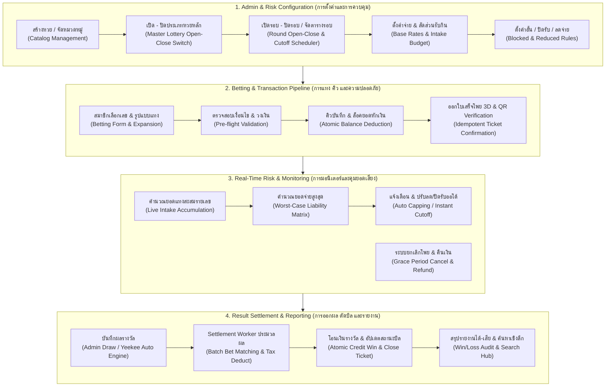
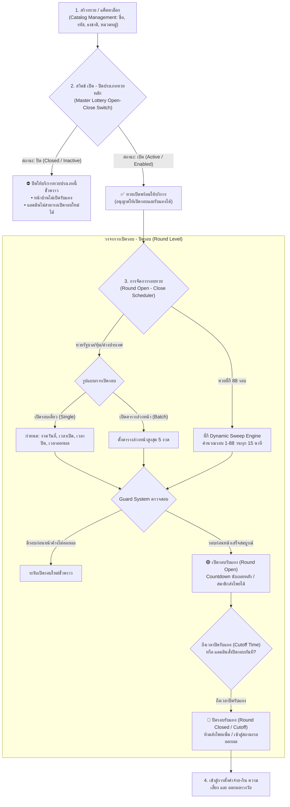
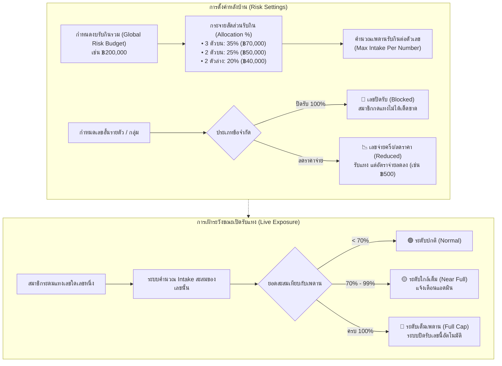
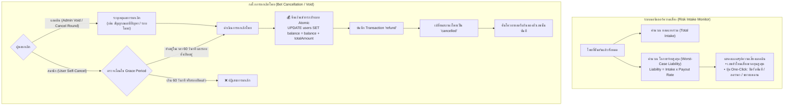
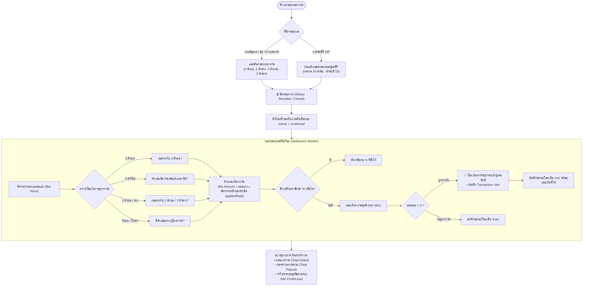
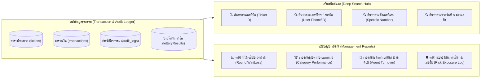

# 📘 AK88 LOTTO — Master System Architecture & Engine Documentation (DOC)

> **เวอร์ชันเอกสาร:** 2.4 (Production Certified)  
> **อัปเดตล่าสุด:** 04 ตุลาคม 2026  
> **ระบบฐานข้อมูล:** Supabase PostgreSQL / Multi-Region Distributed Engine  
> **สถานะระบบ:** 🟢 **Production Ready (Vercel + Docker Ready)**

---

## สารบัญ (Table of Contents)
1. [ภาพรวมสถาปัตยกรรมระดับองค์กร (Enterprise Architecture Overview)](#1-ภาพรวมสถาปัตยกรรมระดับองค์กร)
2. [ไดอาแกรมวงจรชีวิตหวยและการเปิดรอบ (Lottery Lifecycle & Scheduling)](#2-ไดอาแกรมวงจรชีวิตหวยและการเปิดรอบ)
3. [ไดอาแกรมการตั้งค่าความเสี่ยง งบรับกิน และเลขอั้น (Risk & Intake Management)](#3-ไดอาแกรมการตั้งค่าความเสี่ยง-งบรับกิน-และเลขอั้น)
4. [ไดอาแกรมกระบวนการแทง คิว และความปลอดภัยทางการเงิน (Bet Execution & Idempotency Pipeline)](#4-ไดอาแกรมกระบวนการแทง-คิว-และความปลอดภัยทางการเงิน)
5. [ไดอาแกรมการมอนิเตอร์ยอดรับสูงสุดและระบบยกเลิกโพย (Exposure Monitoring & Cancellation)](#5-ไดอาแกรมการมอนิเตอร์ยอดรับสูงสุดและระบบยกเลิกโพย)
6. [ไดอาแกรมเครื่องจักรออกผล ตัดหวย และจ่ายเงินรางวัล (Result Settlement Engine)](#6-ไดอาแกรมเครื่องจักรออกผล-ตัดหวย-และจ่ายเงินรางวัล)
7. [ไดอาแกรมระบบรายงาน การค้นหา และตรวจสอบบัญชี (Reporting & Audit Hub)](#7-ไดอาแกรมระบบรายงาน-การค้นหา-และตรวจสอบบัญชี)
8. [โครงสร้างตารางฐานข้อมูลและ Data Dictionary (Schema Specifications)](#8-โครงสร้างตารางฐานข้อมูลและ-data-dictionary)
9. [คู่มือการติดตั้งและการรันระบบผ่าน Docker (Container Deployment)](#9-คู่มือการติดตั้งและการรันระบบผ่าน-docker)

---

## 1. ภาพรวมสถาปัตยกรรมระดับองค์กร

ระบบ AK88 LOTTO ออกแบบด้วยหลักการ **Event-Driven & Atomic Financial Ledger** เพื่อรับประกันความถูกต้องแม่นยำทางการเงิน ป้องกันข้อผิดพลาดการแทงซ้ำ (Double Spending) และควบคุมความเสี่ยงของเจ้ามือได้อย่างสมบูรณ์



---

## 2. ไดอาแกรมวงจรชีวิตหวย: การเปิด-ปิดประเภทหวยหลัก สู่ การเปิดรอบ-ปิดรอบ (2-Tier Hierarchy)

ตามหลักการทำงานจริงของระบบหวยสากล ขั้นตอนการเปิด-ปิดถูกแยกออกเป็น **2 ระดับชั้น (2 Tiers)** อย่างชัดเจน:

1. **ระดับที่ 1 — เปิด - ปิดประเภทหวยหลัก (Master Lottery Open/Close Switch):**  
   หลังจาก **"สร้างหวย / แค็ตตาล็อก"** เสร็จสิ้นแล้ว จะต้องผ่านสวิตช์เปิด-ปิดหลักของหวยชนิดนั้นก่อน เพื่อควบคุมว่าหวยชนิดนี้ *"เปิดให้บริการ (Active)"* หรือ *"ปิดพักระบบ/ปิดปรับปรุง (Closed/Disabled)"* หากหวยปิดอยู่ในระดับมาสเตอร์ ระบบหน้าบ้านจะไม่เปิดรับแทง และระบบหลังบ้านจะไม่สามารถเปิดรอบใหม่ได้
2. **ระดับที่ 2 — เปิดรอบ และ ปิดรอบ (Round Open & Close Lifecycle):**  
   เมื่อประเภทหวยหลักอยู่ในสถานะ **"เปิด"** แล้วเท่านั้น จึงจะสามารถ:
   - **เปิดรอบ (Open Round):** กำหนดงวดวันที่, เวลาเปิดรับแทง, เวลาปิดรับแทง และเวลาออกผล (ทั้งแบบรอบเดี่ยว, ตาราง 5 งวดล่วงหน้า หรือยี่กี 88 รอบอัตโนมัติ)
   - **ปิดรอบ (Close Round / Cutoff):** เมื่อหมดเวลานับถอยหลัง หรือแอดมินกดสั่งปิดรอบฉุกเฉิน ระบบจะตัดรอบทันที ห้ามส่งโพยเพิ่ม และเปลี่ยนสถานะรอบเป็น *"รอผลรางวัล (Pending Result)"*



---

## 3. ไดอาแกรมการตั้งค่าความเสี่ยง งบรับกิน และเลขอั้น

โครงสร้างการควบคุมความเสี่ยงของเจ้ามือ (Risk Management) คำนวณเป็นเมทริกซ์ 3 ชั้น:

1. **อัตราจ่ายเต็ม (Base Payout Rates):** เช่น 3 ตัวบน ฿900, 2 ตัวบน ฿92
2. **งบรับกินรวม (Global Risk Budget) & การจัดสรรสัดส่วน (Allocation %):**
   $$\text{Max Intake Per Number} = \frac{\text{Global Budget} \times \text{Allocation \%}}{\text{Exposure Weight}}$$
3. **การควบคุมเลขอั้น (Risk Limits):**
   - **เลขปิดรับ 100% (Blocked):** ระบบปฏิเสธการแทงทันที
   - **เลขลดราคาจ่าย (Reduced / Halved Payout):** สมาชิกยังคงแทงได้ แต่อัตราจ่ายถูกปรับลง (เช่น ฿900 เหลือ ฿500) และบันทึก `payoutRate` นั้นลงบิลทันที



---

## 4. ไดอาแกรมกระบวนการแทง คิว และความปลอดภัยทางการเงิน

ระบบปฏิบัติตามมาตรฐาน **Financial Idempotency** เพื่อรับประกันว่าไม่มีการแทงซ้ำซ้อน และยอดเงินถูกตัดแบบ Atomic:


---

## 5. ไดอาแกรมการมอนิเตอร์ยอดรับสูงสุดและระบบยกเลิกโพย



---

## 6. ไดอาแกรมเครื่องจักรออกผล ตัดหวย และจ่ายเงินรางวัล



---

## 7. ไดอาแกรมระบบรายงาน การค้นหา และตรวจสอบบัญชี



---

## 8. โครงสร้างตารางฐานข้อมูลและ Data Dictionary

### 8.1 ตาราง `users` (ตารางสมาชิกและกระเป๋าเงิน)
| ฟิลด์ | ชนิดข้อมูล | คำอธิบาย |
|---|---|---|
| `id` | `VARCHAR(64)` | รหัสผู้ใช้ (เช่น `user_a123456`) (Primary Key) |
| `username` | `VARCHAR(50)` | ยูสเซอร์เนมเข้าสู่ระบบ |
| `phone` | `VARCHAR(20)` | เบอร์โทรศัพท์สำหรับเข้าสู่ระบบ |
| `password` | `VARCHAR(100)` | รหัสผ่านผู้ใช้งาน |
| `balance` | `DECIMAL(12, 2)` | ยอดเงินคงเหลือในกระเป๋าหลัก |
| `role` | `VARCHAR(20)` | สิทธิ์การใช้งาน (`user`, `agent`, `admin`, `owner`) |
| `status` | `VARCHAR(20)` | สถานะบัญชี (`active`, `suspended`, `banned`) |

### 8.2 ตาราง `tickets` (ตารางโพยหวย)
| ฟิลด์ | ชนิดข้อมูล | คำอธิบาย |
|---|---|---|
| `id` | `VARCHAR(64)` | Document ID ในระบบ (Primary Key) |
| `ticketId` | `VARCHAR(50)` | รหัสบิลอ้างอิง (เช่น `TK-TH-20261004-8891`) |
| `userId` | `VARCHAR(64)` | รหัสสมาชิกผู้ส่งโพย |
| `lotteryType` | `VARCHAR(50)` | ชื่อประเภทหวย (เช่น `หวยรัฐบาลไทย`) |
| `roundId` | `VARCHAR(64)` | รหัสงวดหวย |
| `totalAmount` | `DECIMAL(10, 2)` | ยอดเงินแทงรวมของบิล |
| `potentialMaxWin` | `DECIMAL(12, 2)` | โอกาสได้รับรางวัลสูงสุดตามอัตราจ่าย |
| `bets` | `JSONB` | อาเรย์รายการแทง `[{type, number, amount, payoutRate}]` |
| `status` | `VARCHAR(30)` | สถานะโพย (`pending_cancellation`, `active`, `win`, `lose`, `cancelled`) |
| `winAmount` | `DECIMAL(12, 2)` | ยอดเงินรางวัลที่ได้รับจริงหลังออกผล |
| `expiresAt` | `TIMESTAMP` | เวลาหมดอายุ Grace Period สำหรับยกเลิกบิล |
| `createdAt` | `TIMESTAMP` | วันที่และเวลาที่บันทึกโพย |

### 8.3 ตาราง `transactions` (ตารางประวัติธุรกรรมการเงิน)
| ฟิลด์ | ชนิดข้อมูล | คำอธิบาย |
|---|---|---|
| `id` | `VARCHAR(64)` | รหัสธุรกรรม (Primary Key) |
| `userId` | `VARCHAR(64)` | รหัสสมาชิก |
| `type` | `VARCHAR(20)` | ประเภทธุรกรรม (`deposit`, `withdraw`, `bet`, `win`, `refund`) |
| `amount` | `DECIMAL(12, 2)` | จำนวนเงินของธุรกรรม |
| `description` | `TEXT` | รายละเอียดธุรกรรม (เช่น `ส่งโพย TK-TH-...`, `คืนเงินยกเลิกโพย`) |
| `createdAt` | `TIMESTAMP` | วันเวลาที่เกิดธุรกรรม |

---

## 9. คู่มือการติดตั้งและการรันระบบผ่าน Docker

ระบบมีไฟล์คอนฟิก **Container Production** รองรับการ Deploy ได้ทันทีทั้งแบบ Standalone Container หรือ Docker Compose:

### 9.1 คำสั่งเริ่มการทำงาน (Start Service)
```bash
# สั่งสร้างอิมเมจและรันโปรดักชันคอนเทนเนอร์ในโหมด Background
docker-compose up -d --build
```

### 9.2 การตรวจสอบสถานะและ Logs
```bash
# ตรวจสอบสถานะคอนเทนเนอร์และ Health Check
docker ps -a --filter name=ak88-lotto-production

# ดูบันทึกการทำงานแบบ Realtime
docker logs -f ak88-lotto-production
```

### 9.3 การหยุดการทำงาน (Graceful Shutdown)
```bash
docker-compose down
```
