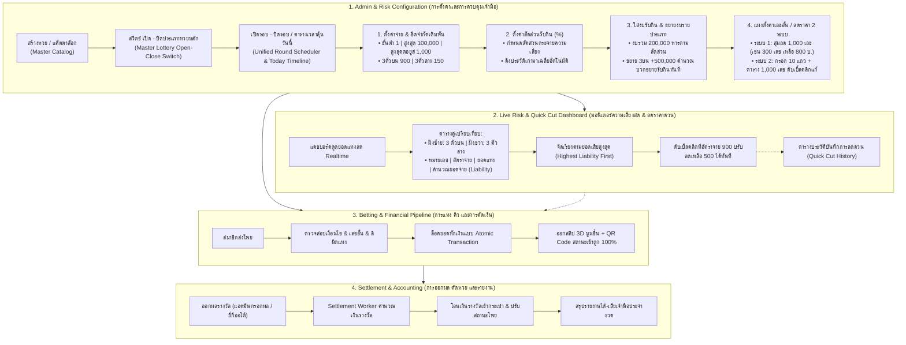
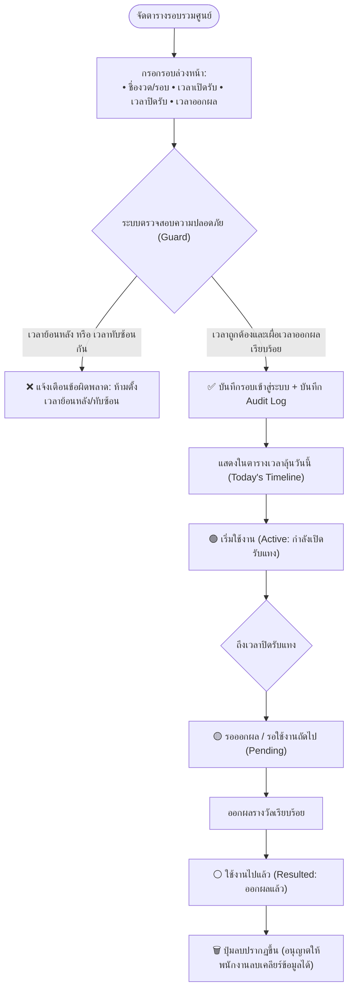
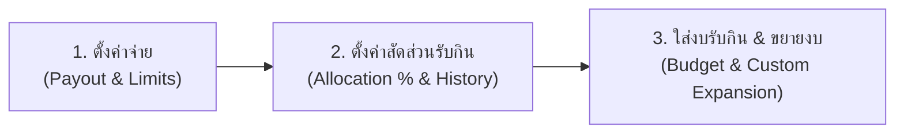
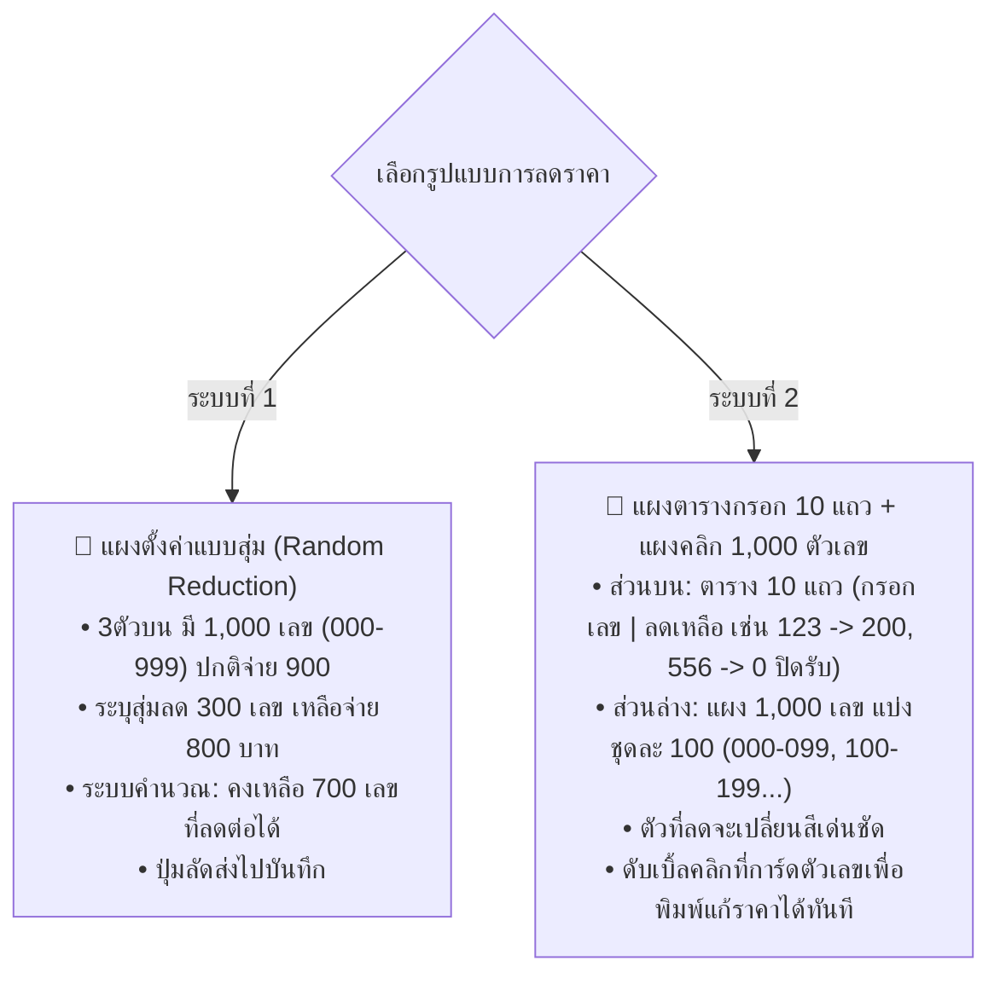
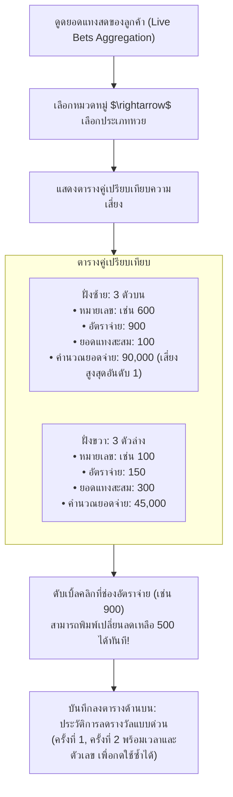
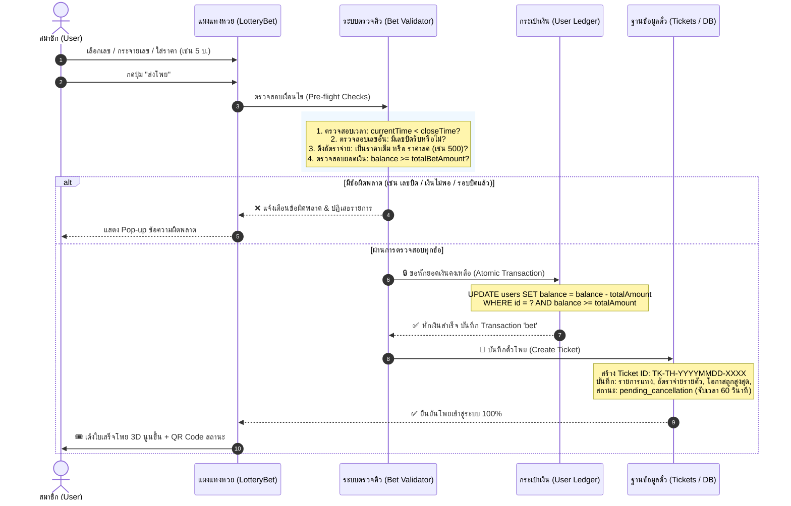
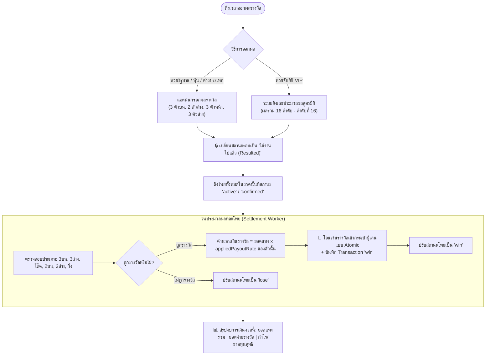

# 📘 AK88 LOTTO — Master System Architecture & Engine Documentation (DOC)

> **เวอร์ชันเอกสาร:** 2.5 (Professional Bookmaker Core Architecture)  
> **อัปเดตล่าสุด:** 05 ตุลาคม 2026  
> **ระบบฐานข้อมูล:** Supabase PostgreSQL / Realtime Event Ledger  
> **สถานะระบบ:** 🟢 **Production Ready (Vercel + Docker Ready)**

---

## สารบัญ (Table of Contents)
1. [ภาพรวมสถาปัตยกรรมระดับองค์กร (Master Blueprint Flowchart)](#1-ภาพรวมสถาปัตยกรรมระดับองค์กร)
2. [ระบบเปิดรอบและจัดตารางรอบรวมศูนย์ (Unified Round Scheduler & Today Timeline)](#2-ระบบเปิดรอบและจัดตารางรอบรวมศูนย์)
3. [กลไกการตั้งค่าความเสี่ยง 3 ขั้นตอน (3-Step Financial & Risk Engine)](#3-กลไกการตั้งค่าความเสี่ยง-3-ขั้นตอน)
   - 3.1 [ขั้นตอนที่ 1: ตั้งค่าจ่ายและขีดจำกัดเดิมพัน (Payout Rates & Limits)](#31-ขั้นตอนที่-1-ตั้งค่าจ่ายและขีดจำกัดเดิมพัน)
   - 3.2 [ขั้นตอนที่ 2: ตั้งค่าสัดส่วนรับกินพร้อมระบบดึงประวัติเฉลี่ย (Allocation % & History Auto-Average)](#32-ขั้นตอนที่-2-ตั้งค่าสัดส่วนรับกินพร้อมระบบดึงประวัติเฉลี่ย)
   - 3.3 [ขั้นตอนที่ 3: ใส่งบรับกินและการขยายงบเฉพาะประเภท (Intake Budget & Custom Expansion)](#33-ขั้นตอนที่-3-ใส่งบรับกินและการขยายงบเฉพาะประเภท)
4. [แผงตั้งค่าลดราคาเลขอั้น 2 ระบบ (Dual-Mode Number Reduction Panel)](#4-แผงตั้งค่าลดราคาเลขอั้น-2-ระบบ)
   - 4.1 [ระบบที่ 1: แผงลดราคาแบบสุ่ม (Random 1,000 Numbers Reduction)](#41-ระบบที่-1-แผงลดราคาแบบสุ่ม)
   - 4.2 [ระบบที่ 2: แผงตารางกรอก 10 แถว + แผงคลิก 1,000 ตัวเลข (Manual 10-Row Form & 1,000 Interactive Grid)](#42-ระบบที่-2-แผงตารางกรอก-10-แถว--แผงคลิก-1000-ตัวเลข)
5. [แดชบอร์ดมอนิเตอร์ความเสี่ยงสดและระบบลดเลขด่วน (Live Risk Dashboard & Quick Cut)](#5-แดชบอร์ดมอนิเตอร์ความเสี่ยงสดและระบบลดเลขด่วน)
   - 5.1 [ตารางคู่เปรียบเทียบ 3 ตัวบน vs 3 ตัวล่าง (Side-by-Side Worst-Case Liability)](#51-ตารางคู่เปรียบเทียบ-3-ตัวบน-vs-3-ตัวล่าง)
   - 5.2 [ระบบดับเบิ้ลคลิกปรับลดราคาด่วน (Double-Click Quick Cut)](#52-ระบบดับเบิ้ลคลิกปรับลดราคาด่วน)
   - 5.3 [ตารางประวัติบันทึกการลดด่วน (Quick Cut History Log)](#53-ตารางประวัติบันทึกการลดด่วน)
6. [กระบวนการแทง คิว และการตัดเงินแบบ Atomic (Bet Execution & Idempotency Pipeline)](#6-กระบวนการแทง-คิว-และการตัดเงินแบบ-atomic)
7. [เครื่องจักรออกผล ตัดหวย และคิดเงินรางวัล (Result Settlement Engine)](#7-เครื่องจักรออกผล-ตัดหวย-และคิดเงินรางวัล)
8. [โครงสร้างตารางฐานข้อมูล (Data Dictionary & Schema Specifications)](#8-โครงสร้างตารางฐานข้อมูล)
9. [คู่มือการติดตั้งและการรันระบบผ่าน Docker (Container Deployment)](#9-คู่มือการติดตั้งและการรันระบบผ่าน-docker)

---

## 1. ภาพรวมสถาปัตยกรรมระดับองค์กร

ระบบ AK88 LOTTO ออกแบบด้วยมาตรฐานของเจ้ามือมืออาชีพ (Professional Bookmaker Platform) แยกส่วนการทำงานของ **การเปิดหวย $\rightarrow$ สวิตช์เปิด/ปิดหลัก $\rightarrow$ การเปิดรอบ/ปิดรอบ $\rightarrow$ การตั้งค่าการเงิน 3 ขั้นตอน $\rightarrow$ แผงลดเลขอั้น $\rightarrow$ แดชบอร์ดมอนิเตอร์สด** ออกจากกันอย่างเป็นระบบ เพื่อความเข้าใจและควบคุมได้ 100%:



---

## 2. ระบบเปิดรอบและจัดตารางรอบรวมศูนย์

ระบบรวมศูนย์การเปิดรอบและจัดตารางไว้ใน **หน้าเดียวกันทั้งหมด** ไม่ต้องสลับหน้าจอ และ **ตัดฟังก์ชันปฏิทินที่ซับซ้อนออก** เปลี่ยนเป็น **"ตารางเวลาลุ้นวันนี้ (Today's Timeline & Action Schedule)"** เพื่อให้เจ้ามือและพนักงานเห็นชัดเจนว่าวันนี้มีรอบไหนเปิดรับ รอบไหนปิดรับ และรอบไหนเวลาออกผล

### 2.1 โครงสร้าง 3 สถานะที่ชัดเจน (3 Operational States)
1. **🟢 เริ่มใช้งาน (Active / กำลังเปิดรับแทง):** รอบที่กำลังเปิดรับแทงอยู่ขณะนี้ มีนาฬิกานับถอยหลังสู่เวลาปิดรับ สมาชิกหน้าบ้านสามารถส่งโพยได้
2. **🟡 รอใช้งาน (Upcoming / รอเปิดตามเวลา):** รอบที่จัดตารางล่วงหน้าไว้ ยังไม่ถึงเวลาเปิดรับแทง
3. **⚪ ใช้งานไปแล้ว (Resulted / Settled / ออกผลแล้ว):** รอบที่ปิดรับและออกผลรางวัลเสร็จสิ้นแล้ว

### 2.2 กฎความปลอดภัยของปุ่มลบ (Safe Delete Rule)
- **ปุ่ม "ลบ" จะปรากฏเฉพาะรอบที่อยู่ในสถานะ "ใช้งานไปแล้ว" เท่านั้น**
- ห้ามมีปุ่มลบในรอบที่ `เริ่มใช้งาน` หรือ `รอใช้งาน` เด็ดขาด เพื่อป้องกันแอดมินหรือพนักงานเผลอกดลบรอบที่มีสมาชิกแทงโพยค้างอยู่ เมื่อรอบผ่านการใช้งานไปแล้ว พนักงานจึงสามารถกดลบเพื่อเคลียร์พื้นที่ได้

### 2.3 กฎการตรวจสอบเวลาและความปลอดภัย (Validation & Audit Guard)
- **ห้ามสร้างเวลาย้อนหลัง:** เวลาเปิดรับต้องเป็นเวลาข้างหน้า (เวลาปัจจุบันขึ้นไป)
- **ห้ามเวลาทับซ้อนกัน (No Overlapping):** รอบใหม่ต้องไม่ทับซ้อนกับรอบที่มีอยู่เดิม
- **เผื่อเวลาออกผลรางวัล:** ต้องกำหนดช่วงเวลาปิดรับและออกผลให้ชัดเจน เพื่อให้ระบบตัดรอบและเตรียมออกผลได้อย่างปลอดภัย
- **บันทึก Audit Log:** บันทึกประวัติการตั้งค่ารอบทุกครั้งว่าใครเป็นผู้สร้าง แก้ไข หรือลบ



---

## 3. กลไกการตั้งค่าความเสี่ยง 3 ขั้นตอน

แยกฟังก์ชันการตั้งค่าความเสี่ยงออกเป็น 3 ขั้นตอนอย่างเป็นเอกเทศ เพื่อความเข้าใจและคำนวณได้อย่างถูกต้องแม่นยำ:



### 3.1 ขั้นตอนที่ 1: ตั้งค่าจ่ายและขีดจำกัดเดิมพัน
- **1.1 ขีดจำกัดเดิมพัน (Bet Limits):**
  - **แทงขั้นต่ำ:** 1 บาท
  - **แทงสูงสุดต่อครั้ง/บิล:** 100,000 บาท
  - **แทงสูงสุดต่อยูสเซอร์ (User Exposure Cap):** 1,000 บาท (ต่อเลขหรือต่อคน เพื่อจำกัดความเสี่ยงไม่ให้ผู้เล่นคนเดียวแทงท่วม)
- **1.2 อัตราจ่ายตามประเภทหวย (Base Payout Rates by Bet Type):**
  - **3 ตัวบน:** ฿900.00
  - **3 ตัวล่าง:** ฿150.00
  - **3 ตัวโต๊ด:** ฿120.00
  - **2 ตัวบน:** ฿92.00
  - **2 ตัวล่าง:** ฿92.00
  - **2 ตัวโต๊ด:** ฿13.00
  - **วิ่งบน:** ฿3.20
  - **วิ่งล่าง:** ฿4.20

### 3.2 ขั้นตอนที่ 2: ตั้งค่าสัดส่วนรับกินพร้อมระบบดึงประวัติเฉลี่ย
- กำหนดสัดส่วนการกระจายความเสี่ยงเป็นเปอร์เซ็นต์ (%) ของแต่ละประเภทหวย (ผลรวมเท่ากับ 100%)
  - เช่น 3 ตัวบน = 35%, 2 ตัวบน = 25%, 2 ตัวล่าง = 20%, 3 ตัวล่าง = 10%, 3 ตัวโต๊ด = 6%, วิ่ง = 4%
- **ปุ่มดึงประวัติการเล่นเก่ามาเฉลี่ยอัตโนมัติ (Historical Auto-Average):**
  - ระบบจะดึงยอดแทงจริงจากรอบที่ผ่านมา วิเคราะห์พฤติกรรมการแทงของลูกค้าว่าระดมแทงประเภทไหนกี่เปอร์เซ็นต์
  - ระบบคำนวณและเกลี่ยสัดส่วน % ให้สอดคล้องกับพฤติกรรมจริงของลูกค้าโดยอัตโนมัติ เจ้ามือสามารถกดนำไปใช้ได้ทันที

### 3.3 ขั้นตอนที่ 3: ใส่งบรับกินและการขยายงบเฉพาะประเภท
- **งบรับกินรวม (Global Risk Budget):** เช่น ระบุงบรวม `200,000` บาท
- **การหารตามสัดส่วน:** ระบบจะนำงบรวมไปกระจายตาม % จากขั้นตอนที่ 2:
  $$\text{Base Budget 3ตัวบน} = 200,000 \times 35\% = 70,000 \text{ บาท}$$
- **ฟังก์ชันขยายงบเฉพาะประเภท (Custom Type Expansion):**
  - เจ้ามือต้องการเปิดรับ 3 ตัวบนเพิ่มเป็นพิเศษ โดยระบุช่องเพิ่มงบ: `+500,000` บาท
  - ระบบจะนำไปคำนวณบวกเพิ่มทันที:
    $$\text{Total Budget 3ตัวบน} = 70,000 + 500,000 = 570,000 \text{ บาท}$$
  - จากนั้นระบบจะคำนวณขยาย **"เพดานรับกินต่อตัวเลข (Max Intake Per Number)"** ของ 3 ตัวบนเพิ่มขึ้นโดยอัตโนมัติ เพื่อให้ระบบหน้าบ้านเปิดรับแทง 3 ตัวบนได้เพิ่มขึ้นตามงบใหม่ทันที

---

## 4. แผงตั้งค่าลดราคาเลขอั้น 2 ระบบ

เจ้ามือสามารถเลือก **"ดึงการตั้งค่างวดเดิมมาใช้"** หรือ **"เริ่มตั้งค่าใหม่"** โดยมี 2 ระบบในแผงเดียว:



### 4.1 ระบบที่ 1: แผงลดราคาแบบสุ่ม (Random 1,000 Numbers)
- สำหรับหวย 3 ตัวบน ซึ่งมีตัวเลขทั้งหมด 1,000 เลข (000 ถึง 999) อัตราจ่ายปกติ 900 บาท
- **การทำงาน:**
  - ระบุจำนวนตัวเลขที่ต้องการสุ่มลด: เช่น `300` เลข
  - ระบุอัตราจ่ายที่ต้องการลดเหลือ: เช่น `800` บาท
  - กดปุ่ม "🎲 สุ่มลดราคาตัวเลขทันที"
  - ระบบจะสุ่มเลือก 300 ตัวเลข และปรับอัตราจ่ายเหลือ 800 บาท
  - ระบบจะแสดงยอดสรุปทันที: **"คงเหลือ 700 เลขที่สามารถลดต่อได้"**
  - มีปุ่มลัดส่งไปบันทึกลงฐานข้อมูลทันที

### 4.2 ระบบที่ 2: แผงตารางกรอก 10 แถว + แผงคลิก 1,000 ตัวเลข (Manual Form & 1,000 Grid)
- **ส่วนบน — แผงตารางกรอก 10 แถว (10-Row Form):**
  - มี 10 แถวให้พิมพ์ `กรอกเลข` และ `ลดเหลือ`
    - แถวที่ 1: `123` $\rightarrow$ ลดเหลือ `200`
    - แถวที่ 2: `452` $\rightarrow$ ลดเหลือ `300`
    - แถวที่ 3: `556` $\rightarrow$ ลดเหลือ `0` (ระบุ 0 คือ **ปิดรับแทง 100%**)
  - มีปุ่ม "กดส่ง บันทึกการลดเลขแผง 10 แถว"
- **ส่วนล่าง — แผงแสดงตัวเลข 1,000 ตัว (000-999):**
  - มีแถบปุ่มเลือกชุดละ 100 เลข: `000-099`, `100-199`, `200-299`, ..., `900-999`
  - แสดงการ์ดตัวเลขเรียงกัน `001`, `002`, `003`, `004`...
  - **ตัวเลขที่ถูกลดราคาหรือปิดรับจะเปลี่ยนสีเด่นชัด** (เช่น สีส้มพร้อมป้าย "จ่าย ฿200" หรือสีแดง "ปิดรับ")
  - **Double-Click Edit:** ผู้ใช้สามารถ **ดับเบิ้ลคลิก** ที่การ์ดตัวเลขใดๆ เพื่อเปิดกล่องแก้ไขราคาและพิมพ์เปลี่ยนอัตราจ่ายได้ทันที!

---

## 5. แดชบอร์ดมอนิเตอร์ความเสี่ยงสดและระบบลดเลขด่วน

ระหว่างที่หวยกำลังเปิดรับแทง แดชบอร์ดนี้จะดูดยอดแทงสดของลูกค้าแบบ Realtime เพื่อให้เจ้ามือเห็นทันทีว่า **"มีโอกาสเสียเงินเท่าไหร่ เสี่ยงเยอะหรือไม่"**



### 5.1 ตารางคู่เปรียบเทียบ 3 ตัวบน vs 3 ตัวล่าง
- จัดวางตารางคู่แบบ Side-by-Side:
  - **ฝั่งซ้าย:** ตาราง `3 ตัวบน`
  - **ฝั่งขวา:** ตาราง `3 ตัวล่าง`
- **โครงสร้างคอลัมน์:**
  - `หมายเลข (Number)`
  - `อัตราจ่าย (Payout Rate)`
  - `ยอดแทงสะสม (Accumulated Intake)`
  - `คำนวณจ่าย (Worst-Case Liability)`
- **ตัวอย่างข้อมูล:**
  - เลข `600` | อัตราจ่าย `900` | ยอดแทง `100` บ. | **คำนวณจ่าย `90,000` บ.**
  - เลข `123` | อัตราจ่าย `900` | ยอดแทง `50` บ. | **คำนวณจ่าย `45,000` บ.**
- **การจัดเรียง:** เรียงลำดับจาก **"คำนวณยอดจ่ายสูงสุด (Highest Liability First)"** เพื่อให้เจ้ามือเห็นตัวเลขที่เป็นภัยคุกคามทางการเงินสูงสุดขึ้นมาอยู่อันดับ 1 ทันที

### 5.2 ระบบดับเบิ้ลคลิกปรับลดราคาด่วน (Double-Click Quick Cut)
- แอดมินสามารถ **ดับเบิ้ลคลิก** ที่ตัวเลขอัตราจ่าย (เช่น 900) ในตารางมอนิเตอร์
- ช่องจะเปลี่ยนเป็น Input ให้พิมพ์ลดราคา เช่น ลดเหลือ `500` บาท
- เมื่อกด Enter หรือกดยืนยัน ระบบจะปรับอัตราจ่ายของตัวเลขนั้นเป็นราคาลดทันที และมีผลกับสมาชิกที่แทงเข้ามาหลังจากนั้นโดยไม่ต้องออกจากหน้านี้

### 5.3 ตารางประวัติบันทึกการลดด่วนด้านบน (Quick Cut History Log)
- ด้านบนของแดชบอร์ดมีตารางบันทึกประวัติ:
  - *"ลดรางวัลแบบด่วน ครั้งที่ 1: 3 ตัวบน เลข 600 ลดเหลือ 500 บาท (บันทึกเวลา 14:30:22)"*
  - *"ลดรางวัลแบบด่วน ครั้งที่ 2: 3 ตัวล่าง เลข 100 ลดเหลือ 100 บาท (บันทึกเวลา 14:35:10)"*
- ช่วยให้เจ้ามือตรวจสอบย้อนหลังได้ว่าเคยลดตัวไหนไปแล้วบ้าง และมีปุ่มกดนำการลดด่วนนี้ไปใช้กับงวดถัดไปได้ทันที

---

## 6. กระบวนการแทง คิว และการตัดเงินแบบ Atomic



---

## 7. เครื่องจักรออกผล ตัดหวย และคิดเงินรางวัล



---

## 8. โครงสร้างตารางฐานข้อมูล

### 8.1 ตาราง `risk_intake_configs` (การตั้งค่าความเสี่ยง 3 ขั้นตอน)
| ฟิลด์ | ชนิดข้อมูล | คำอธิบาย |
|---|---|---|
| `id` | `VARCHAR(64)` | รหัสประเภทหวย (เช่น `หวยรัฐบาลไทย`) |
| `minBet` | `DECIMAL(10, 2)` | แทงขั้นต่ำ (ค่าเริ่มต้น 1 บาท) |
| `maxBet` | `DECIMAL(10, 2)` | แทงสูงสุดต่อครั้ง (ค่าเริ่มต้น 100,000 บาท) |
| `maxUserLimit` | `DECIMAL(10, 2)` | แทงสูงสุดต่อยูสเซอร์ (ค่าเริ่มต้น 1,000 บาท) |
| `totalRiskBudget` | `DECIMAL(12, 2)` | งบรับกินรวม (เช่น 200,000 บาท) |
| `subItems` | `JSONB` | อาเรย์การตั้งค่ารายประเภท `[{name, baseRate, allocationPercent, customExpansion, totalTypeBudget, maxIntakePerNumber}]` |

### 8.2 ตาราง `blocked_numbers` (เลขอั้น เลขลดราคา และการลดด่วน)
| ฟิลด์ | ชนิดข้อมูล | คำอธิบาย |
|---|---|---|
| `id` | `VARCHAR(64)` | Document ID (Primary Key) |
| `lotteryType` | `VARCHAR(50)` | ประเภทหวย |
| `betType` | `VARCHAR(30)` | ประเภทแทง (เช่น `3 ตัวบน`, `3 ตัวล่าง`) |
| `number` | `VARCHAR(10)` | ตัวเลขที่อั้นหรือลดราคา (เช่น `600`, `123`) |
| `restrictionType`| `VARCHAR(20)` | ชนิด (`blocked` = ปิดรับ 100%, `reduced` = ลดราคาจ่าย) |
| `customPayoutRate`| `DECIMAL(8, 2)`| ราคาจ่ายที่ลดเหลือ (เช่น `500.00`, `800.00`, หรือ `0` เมื่อปิดรับ) |
| `sourceMode` | `VARCHAR(20)` | แหล่งที่มา (`random`, `manual_form`, `grid_click`, `quick_cut`) |
| `roundId` | `VARCHAR(64)` | งวดที่ใช้งาน (หรือ null ถ้าใช้ทุกงวด) |
| `createdAt` | `TIMESTAMP` | วันเวลาที่บันทึก |

---

## 9. คู่มือการติดตั้งและการรันระบบผ่าน Docker

```bash
# 1. สั่งสร้างอิมเมจและรันโปรดักชันคอนเทนเนอร์ในโหมด Background
docker-compose up -d --build

# 2. ตรวจสอบสถานะคอนเทนเนอร์และ Health Check
docker ps -a --filter name=ak88-lotto-production

# 3. ดูบันทึกการทำงานแบบ Realtime
docker logs -f ak88-lotto-production

# 4. หยุดการทำงานอย่างปลอดภัย
docker-compose down
```
